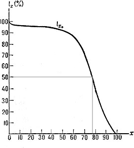

# Calendar for a lifetime #

*Read this in other languages: English, [Русский](README.ru.md)*


Print version and generating script. All images are in the format *\*.png*, size *A0 (1189x841mm)* and resolution *300dpi* (*14043x9933px*). You can print out it in printing company.

The calendar was created as an instrument for introspection. You may note dates of different events and periods in your life, and **estimate their parting in scale of your life**. By the way, the sum of this events and periods shape your personality. This is the way to understand who you are. You can also understand, for example, whether you are ready to sign any long-term contract. Or convert the cost of large purchases to the time spent, for example: "to buy this apartment, I have to spend these 5 years".

Example: picture down - the chart of surviving probability to age. Horizontal axis - age, vertical - percent of people reached such age.<br>
 

Calendars are divided with the year of birth. Headline forms automatically according to this (like `1994 15 years`). Variants available:

* 60 years lifetime calendar, **landscape** paper orientation. Each year has the biggest area. Not yet comes years are shown just to understand the scale. <a href="https://github.com/notdest/png-many-years-calendar-output/tree/master/result/eng/60" target="_blank">image folder :open_file_folder:</a>

* 80 years lifetime calendar, **portrait** paper orientation. Reduced space for each year. <a href="https://github.com/notdest/png-many-years-calendar-output/tree/master/result/eng/80" target="_blank">image folder :open_file_folder:</a>

* 100 years lifetime calendar, **portrait** paper orientation. The area of a year is same as previous, the cells are denser. <a href="https://github.com/notdest/png-many-years-calendar-output/tree/master/result/eng/100" target="_blank">image folder :open_file_folder:</a>

There is also a *pdf-version* on a large number of A4 sheets. ([Download ](https://github.com/notdest/png-many-years-calendar-output/raw/master/result/A4.pdf)).

About the code. The project contains a single file [generator.py](generator.py), that requires the PIL library. It is most interesting for reusing the `printMonth()` and `printYear()` functions at the top. They require a global variable `rus`, the value of which determines the language of the headers (`True` - Russian, `False` - English), and the variable `draw`, which is obtained as follows
```python
image       = Image.new("L", (imageWidth,imageHeight), 255)
draw        = ImageDraw.Draw(image)
```
The remaining variables are intuitively understood from the name. In the case of `yearOfBirth > year`, the `printYear()` function does not print age in the header.

**If English is your native language, please suggest editing this text on an e-mail in my profile or via github**